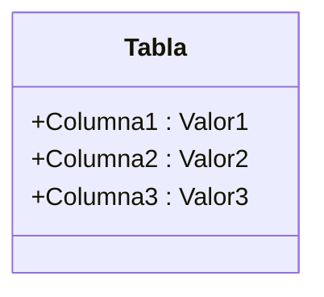

# Markdown Gráfico
## Bloques de Código:
```python
def saludo():
    print("¡Hola Mundo!")

```

```mermaid 
graph LR
    A[Idea] --> B[Planificación]
    B --> C[Desarrollo]
    C --> D[Pruebas]
    D --> E[Implementación]
```

```mermaid
classDiagram
    class Tabla {
        +Columna1 : Valor1
        +Columna2 : Valor2
        +Columna3 : Valor3
    }
```